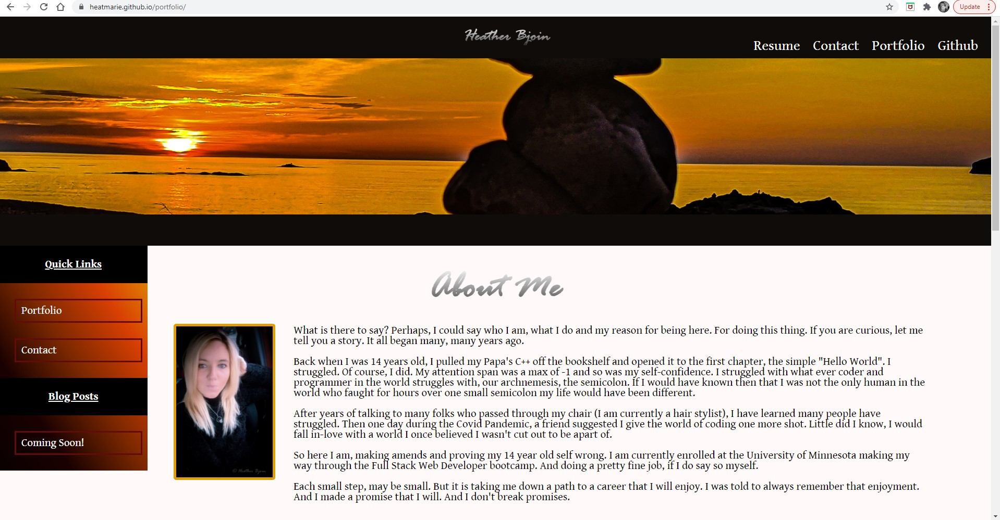
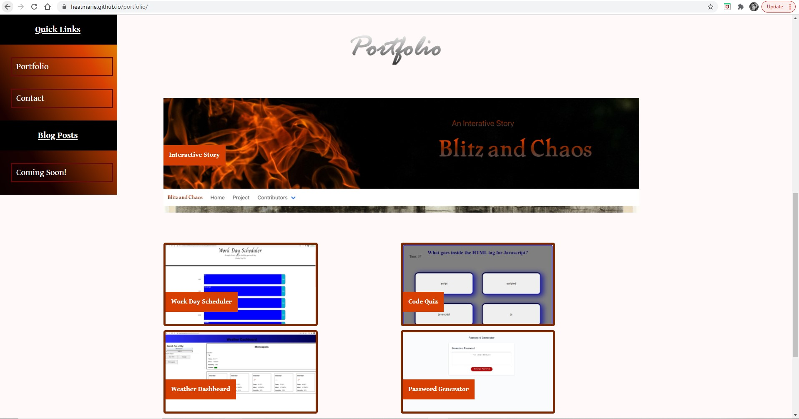

# portfolio
Should be self explanatory, but if not, it's a portfolio ;)  

In addition to that, this is also a homework assignment to begin a portfolio which meets the following the critera. 

The view is presented with the developer's name, a recent photo or avatar, and links to sections about them, their work, and how to contact them
When clicking on one of the nav link the UI scrolls to the corresponding section
When clicking on the link to the section work the UI scrolls to a section with titled images of the developer's applications
The first application's image should be larger in size than the others
WHEN I click on the images of the applications
THEN I am taken to that deployed application
WHEN I resize the page or view the site on various screens and devices
THEN I am presented with a responsive layout that adapts to my viewport

In addition the layout/design of the site should look like the following: 

Now, this was a lot of work because in the criteria it did not initially specify that the portfolio had to match the gif. However, I guess it does so the original portfolio I made was branched off, and this style was created. 

URL : https://heatmarie.github.io/portfolio/

Images :

There are still a few things I need to work on such as the hover seen in the gif and the text overlay for the images. I tried to make sure that the CSS follows a logical order and uses comments to keep things slightly more organized since there is a lot of CSS the images used from Pexels is also commented in the CSS.

The one thing I got from this assignment is that at times you will begin a project, or have it mostly completed and than be presented with a new layout which needs to be done in a short amount of time. And this was good practice for changing the entire layout of a site in four days with a total work of 15 to 20 hours of work. 

